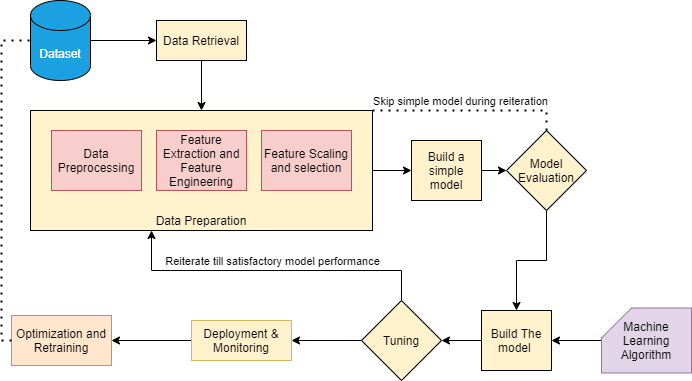

# Rossmann Pharmaceuticals Sales Forecasting

**Table of Contents**

-   Rossmann Pharmaceuticals Sales Forecasting
    -   [Overview](#overview)
    -   [Scenario](#scenario)
    -   [Approach](#approach)
    -   [Project Structure](#project-structure)
        -   [data](#data)
        -   [notebooks](#notebooks)
        -   [root folder](#root-folder)
    -   [Installation guide](#installation-guide)
    -   [ML Pipeline Design](#ml-pipeline-design)

## Overview

This project is part of 10 academy's training week 3 challenge.

## Scenario

The finance team at Rossmann Pharmaceuticals wants to forecast sales in all their stores across several cities six weeks ahead of time.

## Approach

This project is divided and implemented by the following phases

1. Exploration of customer purchasing behavior
2. Prediction of store sales
    - 2.1. Machine learning approach
    - 2.2. Deep Learning approach
3. Serving predictions on a web interface

## Project Structure

The repository has a number of files including python scripts, jupyter notebooks, pdfs and text files. Here is their structure with a brief explanation.

### data:

-   the folder where the dataset files are stored

### notebooks:

-   different jupyter notebooks

### root folder:

-   `.gitignore`: a text file listing files and folders to be ignored
-   `README.md`: Markdown text with a brief explanation of the project and the repository structure.

## Installation guide

```
git clone https://github.com/nahomfix/Pharmaceutical-Sales.git
cd Pharmaceutical-Sales
pip install -r requirements.txt
```

## ML Pipeline Design


